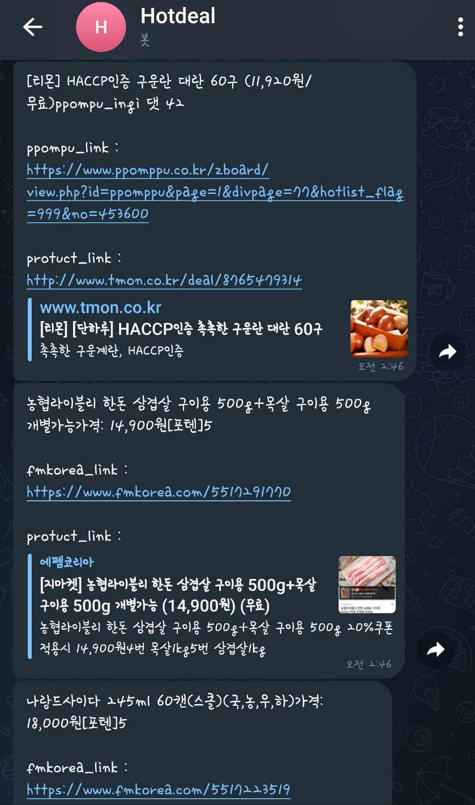

# 핫딜 알리미

### 개요

---

1. 물, 제로콜라, 커피캡슐와 같은 대량의 물품을 싸게 살수 있는 여러 핫딜 사이트들을 한번에 보고싶다
2. 매일 사이트를 들어갈 수 없어 상품을 구매 시기를 놓치거나 상품이 품절되는 경우가 있어 챗봇을 이용하여 실시간으로 알려줌

### 프로그램 개발

---

1. 3가지 대형 사이트의 핫딜 게시판을 정적으로 데이터를 파싱함 (뽐뿌, fmkorea, 쿨엔조이)
    - 제목, 내용, 해당 상품 링크, 해당 사이트 링크, 인기도
2. telegram 챗봇을 통해 데이터를 전송 시킴

3. AWS 클라우드를 통해 항상 프로세스를 구동 시킴
